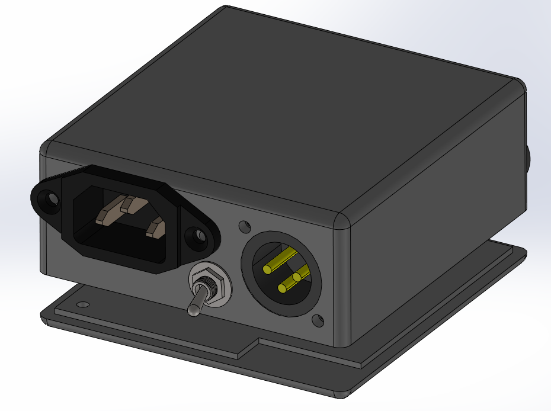

# APS1 (Analog power supply 1)

The APS1 is a single line one output, 20W power supply for analog partyline communication systems with built-in terminaision and RMK.
This power supply is the most basic power supply unit possible. 

## Concept
The APS1 was designed for simplicity and as a base to show how the APSM1 module could be used.

The power supply is composed of:

 - A 220v IEC C14 AC input
 - A male XLR partyline output
 - A rocker switch for the enabling the terminaison
 - One iluminated power switch
 - One RMK switch

## 3D

Here is a render of the case:

And here is the files for 3D printing:

 - Case: [[Solidworks source]](3d/case.SLDPRT) [[STL]](3d/case.STL) 
 - Case cover: [[STL]](3d/case_cover.STL) 

## Cost

The overall cost of this device is pretty low.

Here is an approximation of the cost to build 1 power supply:

| What | Bought were | Cost |  Quantity | Comment |
|------|-------------|------|-----------|---------|
| APSM1 | - | <5eur | 1 |  |
| [HLK-20M24](https://aliexpress.com/item/4001022630440.html) | Aliexpress | 2.96eurs | 1 | The actuall power supply 24v 20W |
| [NC3MAAH (Male XLR)](https://fr.farnell.com/neutrik/nc3maah/plug-xlr-pcb-horizontal-3pole/dp/1310044) | Farnell | 1.656eur | 1 |  |
| [Latching 12mm switch with LED](https://fr.aliexpress.com/item/1005002348278493.html) | Aliexpress | 1.61eur | 1 | Power switch |
| [SPST ON-ON Switch](https://fr.aliexpress.com/item/4001233376500.html) | Aliexpress | 1eur | 1 | Terminaison switch |

Which comes to approximatively 8-10eur without 3d printed parts
*Note that some of the part here can be salvaged or found for way cheaper, which will bring the cost down even more*